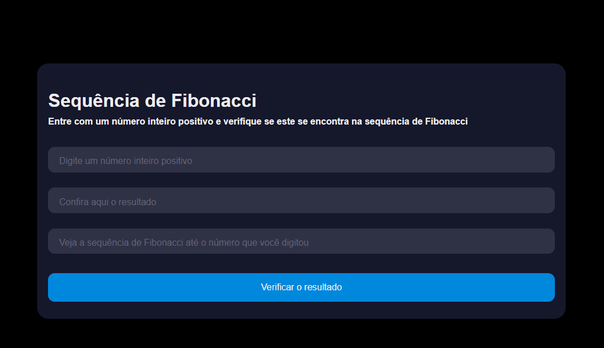

# Sequência de Leonardo Fibonacci 🕵️‍♀️

Insira um número inteiro positivo e veja se este número aparece na lista de sequência de Fibonacci.

## 🚀 Tecnologias utilizadas
- HTML
- CSS
- JavaScript

### Veja isto funcionando:

<h1>
  
</h1>

## 📌 Mas o que é a sequência de Leonardo Fibonacci?

É uma sequência de números inteiros, começando normalmente por 0 e 1, na qual cada termo subsequente corresponde à soma dos dois anteriores.

https://pt.wikipedia.org/wiki/Sequ%C3%AAncia_de_Fibonacci

##

Made with much 💜 by Lucas Virolli 🙋‍♂️
