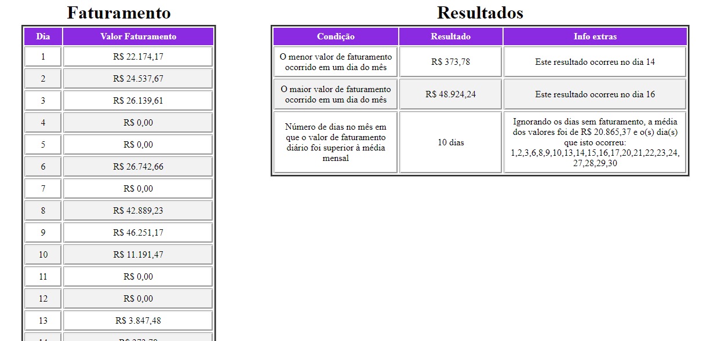

# Faturamento distribuidora (JSON) 📈

Relatório utilizando algumas informações de uma base em formato JSON.  
Informações do relatório:
  - Maior faturamento do mês;
  - Menor faturamento do mês;
  - Quantidade de dias em que o faturamento foi superior à média do mês, sem contar quando houve R$00,00 de faturamento (estes eram finais de semana ou feriado).

## 🚀 Tecnologias utilizadas
- HTML
- CSS
- JavaScript

### Veja isto funcionando:

<h1>
  
</h1>

## ❗ Nota importante (informações extras)

Aqui eu tive a autonomia de acrescentar mais algumas informações que podem ser relevantes. Estas informações você encontra na tabela de "Resultados" na coluna "Info extras".

Informações extras: 
  - O dia em que ocorreram o maior e menor faturamento do mês;
  - O valor da média do faturamento do mês e os dias em que ocorreram faturamento superior à média.

##

Made with much 💜 by Lucas Virolli 🙋‍♂️
