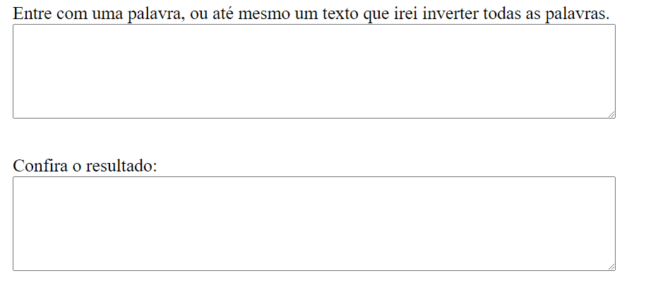

# Invertendo Strings 🤯

Inverta a ordem das palavras com esta aplicação.

## 🚀 Tecnologias utilizadas
- HTML
- CSS
- JavaScript

### Veja isto funcionando:

<h1>
  
</h1>

## ❗ Nota importante

Aqui eu não havia entendido muito bem o que era para fazer, o que eu tinha entendido era para inverter a ordem de uma string assim como eu fiz. Mas tinha uma nota no desafio 
dizendo que não era para utilizar funções prontas como .reverse(). A função reverse inverte a ordem dos elementos de um array, assim como descrito na documentação:

```javascript
var myArray = ['one', 'two', 'three'];
myArray.reverse();

console.log(myArray) // ['three', 'two', 'one']
```

https://developer.mozilla.org/pt-BR/docs/Web/JavaScript/Reference/Global_Objects/Array/reverse

De qualquer forma, se for o caso de inverter a ordem dos elementos de um array assim como a função reverse posso fazer também.

##

Made with much 💜 by Lucas Virolli 🙋‍♂️
